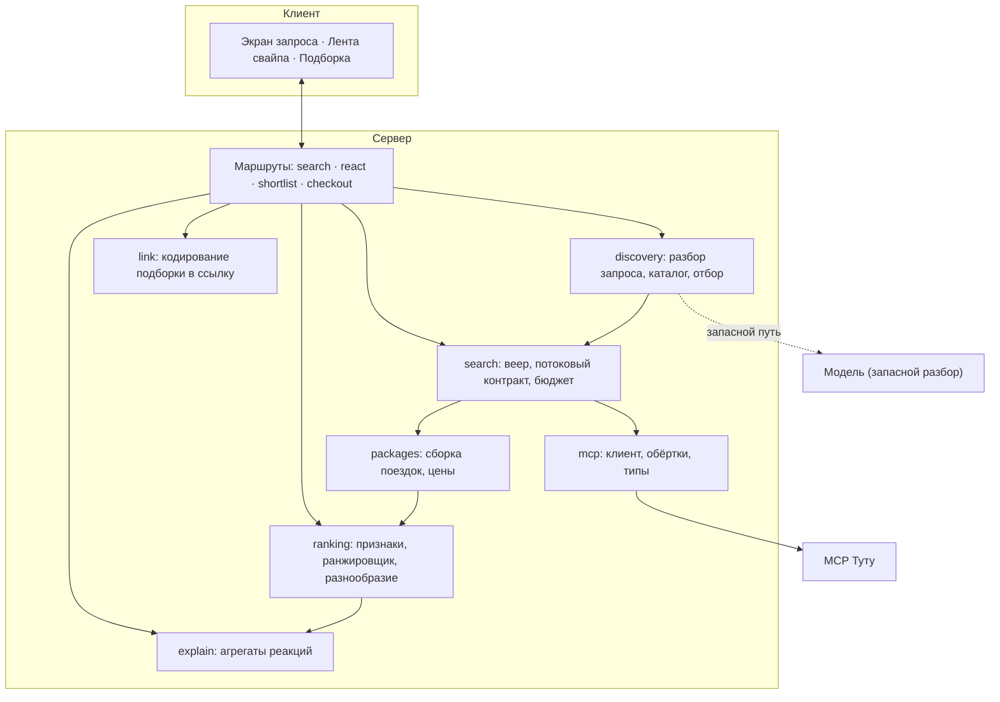

# Architecture — tutu-swipe

**Дата:** 2026-08-04
**Опирается на:** [PRD](PRD.md), [план v2](../docs/plans/2026-08-04-001-feat-tutu-swipe-discovery-plan.md)

---

## Форма системы

Одно приложение Next.js 16 на Vercel. Браузер общается только со своими маршрутами; внешний MCP скрыт за серверным слоем.



**Состояние сессии живёт в браузере.** Реакции, состояние ранжировщика и пул карточек хранятся на клиенте и передаются с каждым запросом. Сервер не хранит ничего между запросами — внешнего хранилища в системе нет.

**Направление зависимостей строго сверху вниз:** маршруты знают о слоях, слои о маршрутах — нет. `ranking` и `explain` не знают о существовании MCP: они работают с уже собранными поездками. `explain` не знает о внутренностях ранжировщика — только об истории реакций.

---

## Слои и их ответственность

| Слой | Отвечает за | Не имеет права |
|---|---|---|
| `src/app/api/*` | HTTP, потоковый ответ, коды ошибок | Содержать доменную логику |
| `discovery` | Разбор запроса, каталог, отбор кандидатов | Обращаться к MCP |
| `search` | Веер, бюджет времени, потоковый контракт | Знать о ранжировании |
| `packages` | Сборка поездки, суммирование цен, предупреждения | Обращаться к MCP напрямую |
| `ranking` | Признаки, ранжировщик, разнообразие | Знать о MCP и о HTTP |
| `explain` | Объяснения из агрегатов реакций | Читать веса модели |
| `mcp` | Клиент, обёртки инструментов, типы ответов | Содержать продуктовую логику |
| `link` | Кодирование и разбор подборки в ссылке | Знать о HTTP и о ранжировании |

---

## Ключевые контракты

### Поток выдачи

Веер отдаёт асинхронную последовательность событий; маршрут транслирует её наружу без изменения смысла.

```text
card           — готовая поездка
candidate_error — направление не ответило или не собралось (штатное событие)
done           — веер завершён, дальше карточек не будет
aborted        — запрос отменён или исчерпан бюджет
```

Контракт принадлежит слою `search` и фиксируется до реализации интерфейса. Клиент не имеет права предполагать, что `card` придут все сразу или что их будет хотя бы один.

### Ранжировщик

Общий интерфейс с двумя реализациями: байесовская модель и взвешенные правила. Обе проходят один контрактный набор тестов, выбор — конфигурацией.

Существование двух реализаций — не запас прочности, а механизм исполнения точки отсечения 15 августа. Без второй реализации решение об откате принять нечем.

### Состояние сессии — на клиенте

Сервер без состояния: реакции, состояние ранжировщика и пул карточек живут в браузере и приходят с запросом. Это убирает целый класс проблем, неизбежных при общем хранилище — версионирование, гонки между маршрутами, потеря реакции при попадании в другой процесс.

Идемпотентность повторной реакции обеспечивается на клиенте: одна реакция на карточку, повтор игнорируется до отправки.

**Цена решения:** сессия не переживает очистку хранилища браузера и не переносится между устройствами. Для продукта, где выбор занимает минуты и заканчивается ссылкой, это приемлемо.

### Подборка — в ссылке

Ссылка несёт параметры поиска и идентификаторы выбранных предложений, а не сами предложения. Страница подборки пересобирает варианты через MCP при открытии.

Причина — размер: `checkout_ref` одного транспортного варианта весит 546 байт, три поездки с жильём дают около 3,4 КБ в кодировке для URL, что режется мессенджерами. Побочная выгода — цены на открытой ссылке свежие.

Если предложение к моменту открытия исчезло, показывается актуальное лучшее по тем же параметрам с пометкой о замене.

---

## Производительность: главный рычаг снаружи

Замер 2026-08-04: холодный вызов `search_multitransport` — 10,8 с, прогретый — 0,5–1,5 с. У MCP Туту серверный кэш, и разница на порядок.

Отсюда стратегия: **греется чужой кэш, а не строится свой**. Скрипт прогрева проходит по каталогу направлений перед демо и перед хакатоном. Собственный кэш существует только в пределах одного процесса как best-effort и ни на что не рассчитывает.

Прямое следствие для критерия AC7: бюджет в 3 секунды выполним по прогретым направлениям. На холодном направлении честное поведение — прогрессивная выдача с индикатором, а не молчаливое десятисекундное ожидание.

---

## Бюджет времени

Единственный `AbortSignal` на пользовательский запрос протягивается до вызовов MCP. Составляющие бюджета — доли целого, а не независимые константы:

```text
общий бюджет запроса
├── разбор запроса      (правила — доли миллисекунд; модель — только запасной путь)
├── отбор кандидатов    (локально, без сети)
└── веер
    ├── дедлайн кандидата
    └── бюджет ретраев внутри вызова
```

**Инвариант:** ретрай не может пережить дедлайн кандидата, дедлайн кандидата не может пережить общий бюджет. Нарушение проявляется как запись в кэш после отправленного ответа — это и проверяется тестом.

---

## Внешние зависимости

| Зависимость | Роль | Поведение при отказе |
|---|---|---|
| MCP Туту | Единственный источник предложений | Частичный отказ штатен; полный — состояние «ничего не нашли» |
| Модель разбора | Только недостающие поля запроса | Уточняющий вопрос по недостающему полю |

Платных сторонних сервисов в системе нет — это ограничение проекта, а не временное состояние. Хранилища, очереди и внешние кэши не вводятся.

---

## Решения и их причины

| Решение | Причина | Что было бы иначе |
|---|---|---|
| MCP только на сервере | Скрытие эндпоинта, единая точка бюджета и кэша | Клиент бы обходил бюджет времени |
| Окно дат фиксируется до поиска | Иначе транспорт→жильё выстраиваются последовательно и 3 секунды недостижимы | Цепочка вместо параллельности |
| Признаки первого круга не из ленивых деталей | Темы отзывов приходят после показа карточки — цикл | Первая карточка ждала бы детали |
| Объяснения не из весов модели | Веса сэмплируются, объяснение было бы нестабильным | Продукт объяснял бы себя случайно |
| Байесовская регрессия, а не логистическая | Нужен апостериор для корректного сэмплирования | Разведка была бы имитацией |
| Состояние сессии на клиенте | Внешних хранилищ нет по ограничению проекта; заодно исчезают гонки между маршрутами | Понадобилось бы версионирование и защита от потери реакций |
| Подборка в ссылке, а не на сервере | Нет хранилища; предложения весят слишком много для URL | Ссылка резалась бы мессенджерами |
| Греется кэш Туту, а не строится свой | Разница холодного и прогретого вызова — порядок величины | Своё кэширование давало бы меньший эффект дороже |

---

## Что архитектура сознательно не решает

- **Масштабирование.** Продукт живёт два дня на защите. Ограничение параллельности и кэш существуют ради бюджета времени и лимитов MCP, а не ради нагрузки.
- **Мультиарендность и аккаунты.** Сессия анонимна и живёт часами.
- **Согласованность цен с Туту.** Гарантируется только показ возраста цены и предупреждение перед переходом; фактическая цена принадлежит Туту.
