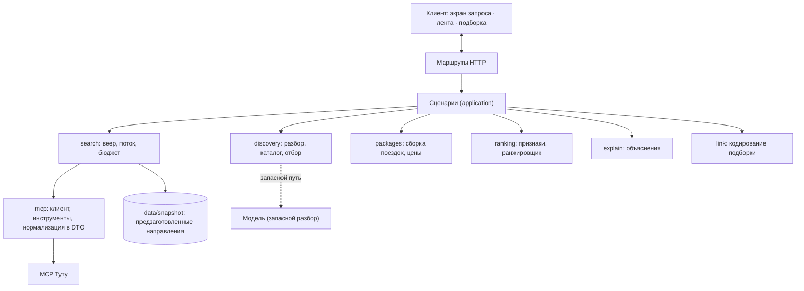
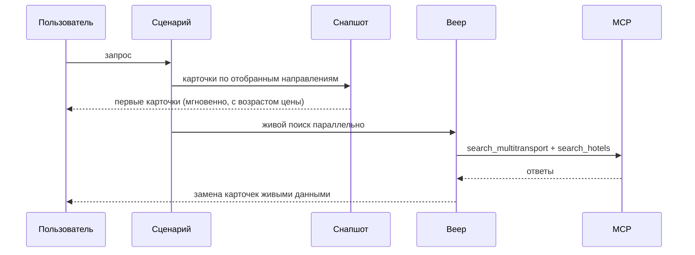

# Architecture — tutu-swipe

**Дата:** 2026-08-04 · **Ревизия:** v2 после ревью Codex
**Опирается на:** [PRD](PRD.md), [план](../docs/plans/2026-08-04-001-feat-tutu-swipe-discovery-plan.md), [замеры](../docs/surprises.md)

---

## Форма системы

Одно приложение Next.js 16 на Vercel. Браузер общается только со своими маршрутами; внешний MCP скрыт за серверным слоем.



**Оркестрация — в слое сценариев, а не в маршрутах.** Маршрут занимается HTTP: разбор запроса, коды ответов, поток. Последовательность «разобрать → отобрать → искать → собрать → ранжировать → объяснить» живёт в сценарии.

**Слои не знают друг о друге.** `packages` не вызывает `ranking`, `ranking` не вызывает `explain` — их связывает сценарий. В прежней редакции диаграмма показывала прямые связи между ними, что противоречило таблице ответственности.

**Домен не знает о MCP.** Слой `mcp` нормализует ответы в доменные DTO. `packages`, `ranking` и `explain` работают с DTO и не импортируют типы MCP — иначе смена источника данных протянется через весь домен.

---

## Слои и их ответственность

| Слой | Отвечает за | Не имеет права |
|---|---|---|
| `src/app/api/*` | HTTP, поток, коды ошибок | Содержать логику последовательности |
| `usecases` | Порядок шагов сценария | Знать о HTTP |
| `discovery` | Разбор запроса, каталог, отбор кандидатов | Обращаться к MCP |
| `search` | Веер, бюджет времени, поток, снапшот | Знать о ранжировании |
| `packages` | Сборка поездки, суммирование, предупреждения | Знать о ранжировании и MCP |
| `ranking` | Признаки, ранжировщик, разнообразие | Знать о MCP, HTTP и объяснениях |
| `explain` | Объяснения из журнала реакций и признаков карточки | Читать веса модели |
| `link` | Кодирование и разбор подборки | Знать о HTTP и ранжировании |
| `mcp` | Клиент, инструменты, нормализация в DTO | Содержать продуктовую логику |

**Вход `explain`:** журнал реакций плюс признаки текущей карточки. Признаки карточки нужны, потому что правило 3 конституции и AC27 требуют сверять объяснение с тем, что в карточке действительно есть.

---

## Время: снапшот как основа, живые данные сверху

Замер 2026-08-04: холодное направление в MCP отвечает 10,8 с, прогретое — 0,5–1,5 с. Прогрев чужого кэша не гарантируется: срок его жизни неизвестен, ключ может включать даты и состав, а на Vercel нет постоянного процесса для прогрева.

Поэтому первый экран не зависит от живого вызова.



**Снапшот** — результат прогона каталога направлений скриптом, сохранённый в репозитории. Обновляется вручную перед хакатоном.

**Честность:** возраст цены показывается на каждой карточке (AC16), замена живыми данными видна пользователю. Снапшот не выдаётся за актуальные данные и не заменяет живой MCP — он закрывает первые секунды, пока идёт настоящий поиск.

**Побочная выгода:** зафиксированный снимок пула, необходимый для воспроизводимости (AC25) и для протокола сравнения ранжировщиков, появляется как часть механизма, а не как отдельная конструкция.

**Что снапшот не решает:** направление вне каталога живёт по живому поиску со всеми его 10 секундами. Для таких запросов честное поведение — прогресс с указанием, что идёт поиск нового направления.

---

## Конфигурация выполнения

Фиксируется явно, потому что от неё зависит, укладывается ли холодный вызов в лимит:

| Параметр | Значение | Почему |
|---|---|---|
| Fluid Compute | включён | Без него лимит длительности на бесплатном тарифе короче холодного вызова MCP |
| `maxDuration` | задаётся явно в конфигурации маршрутов | Умолчание не должно определять поведение |
| Регион | один, ближайший к пользователю | Разброс регионов добавляет задержку к каждому вызову |

Значения лимитов подтверждаются при первом деплое и записываются в `docs/surprises.md`.

---

## Состояние сессии: на клиенте, но не на веру

Сервер не хранит состояние между запросами. Реакции, состояние ранжировщика и пул приходят с запросом.

**Клиенту нельзя доверять.** Всё, что влияет на деньги, доступ или продуктовые ограничения, сервер проверяет заново:

| Что | Как защищено |
|---|---|
| Карточки и цены | Сервер подписывает выданные карточки; неподписанные или изменённые отвергаются |
| Журнал реакций | Подписан; состояние модели **пересчитывается сервером из журнала**, а не принимается готовым |
| Пороги подборки (AC30) | Считаются из длины проверенного журнала, а не из поля в запросе |
| Исключённые города | Выводятся из журнала реакций |
| Размер веера | Ограничен сервером независимо от того, что пришло от клиента |

Подпись — HMAC на серверном секрете из переменных окружения. Внешних сервисов не требует.

**Контракт передачи фиксирован:** передаётся телом POST, а не в URL и не в заголовках. Задаются версия формата, предельное число карточек в пуле и предельное число реакций; превышение — отказ с понятным кодом, а не молчаливое усечение.

**Идемпотентность (AC23):** каждая реакция несёт устойчивый идентификатор, журнал — список реакций. Повтор с тем же идентификатором не меняет журнал. Фильтрации на клиенте недостаточно: есть повторные отправки, две вкладки и восстановление соединения.

**Восстановление (AC11):** журнал, позиция, снимок пула и установка генератора сохраняются в браузере атомарно. Поток несёт идентификаторы событий, чтобы после обрыва продолжить с последнего полученного, а не с начала.

---

## Контракт потока

```text
card(event_id, …)      — готовая поездка
candidate_error(…)     — направление не ответило (штатное событие)
done(…)                — веер завершён
aborted(…)             — запрос отменён или исчерпан бюджет
unavailable(…)         — источник недоступен целиком
```

`unavailable` отделён от `done` с пустым списком намеренно: «предложений нет» и «MCP недоступен» — разные факты, и показывать второе как первое означает врать о состоянии системы.

Контракт принадлежит слою `search` и фиксируется до реализации интерфейса.

---

## Подборка в ссылке

Ссылка несёт параметры поиска и идентификаторы выбранных предложений; страница пересобирает варианты поиском при открытии. Инструмента «получить предложение по идентификатору» в MCP нет — только поиск, поэтому восстановление всегда идёт через повторный поиск по тем же параметрам.

| Свойство | Решение |
|---|---|
| Размещение | Во фрагменте URL (после `#`), а не в параметрах запроса |
| Приватность | Фрагмент не уходит на сервер, не попадает в логи и в `Referer` |
| Целостность | Версия формата и подпись; испорченная ссылка даёт понятную страницу (AC33) |
| Заморозка (AC30) | Замораживаются **выбранные предложения**, а не видимый результат — цены и наличие меняются на стороне Туту |
| Исчезнувшее предложение | Заменяется лучшим по тем же параметрам с явной пометкой о замене |
| Бюджет размера | Задаётся явно и проверяется тестом на трёх поездках |

---

## Бюджет времени

Единственный `AbortSignal` на пользовательский запрос протягивается до вызовов MCP. Составляющие — доли целого:

```text
общий бюджет запроса
├── разбор запроса (правила локально; модель — запасной путь)
├── отбор кандидатов (локально)
└── веер
    ├── дедлайн кандидата
    └── бюджет повторов внутри вызова
```

**Инвариант:** повтор не переживает дедлайн кандидата, дедлайн не переживает общий бюджет.

**`Retry-After` против дедлайна:** заголовок задаёт, когда *можно* повторить, но не обязывает ждать. Если указанная пауза выходит за дедлайн кандидата, повтор не делается вовсе — кандидат помечается как не ответивший. Это снимает противоречие между правилами 9 и 12 конституции.

---

## Внешние зависимости

| Зависимость | Роль | При отказе |
|---|---|---|
| MCP Туту | Единственный источник живых предложений | Частичный отказ штатен; полный — событие `unavailable`, а не «ничего не нашли» |
| Модель разбора | Только недостающие поля запроса | Уточняющий вопрос по недостающему полю |

Платных сторонних сервисов нет — ограничение проекта. Способ вызова модели разбора фиксируется бесплатным или локальным.

---

## Решения и причины

| Решение | Причина |
|---|---|
| Снапшот направлений в репозитории | Холодный вызов MCP — 10,8 с, прогрев чужого кэша не гарантируется |
| Оркестрация в слое сценариев | Иначе ветвление осядет в маршрутах, которым запрещена доменная логика |
| Нормализация MCP в доменные DTO | Иначе домен привязан к формату внешнего сервиса |
| Подпись состояния и пересчёт модели из журнала | Клиент недоверенный; иначе подделываются цены и пороги подборки |
| Подборка во фрагменте URL | Даты, бюджет, состав и возрасты детей не должны попадать в логи и `Referer` |
| Событие `unavailable` отдельно от `done` | Инфраструктурный отказ нельзя показывать как отсутствие предложений |

---

## Что архитектура сознательно не решает

- **Масштабирование.** Продукт живёт два дня на защите.
- **Аккаунты и мультиарендность.** Сессия анонимна.
- **Согласованность цен с Туту.** Гарантируется показ возраста цены и предупреждение перед переходом.
- **Работа без JavaScript.** Механика построена на реакциях в браузере.
