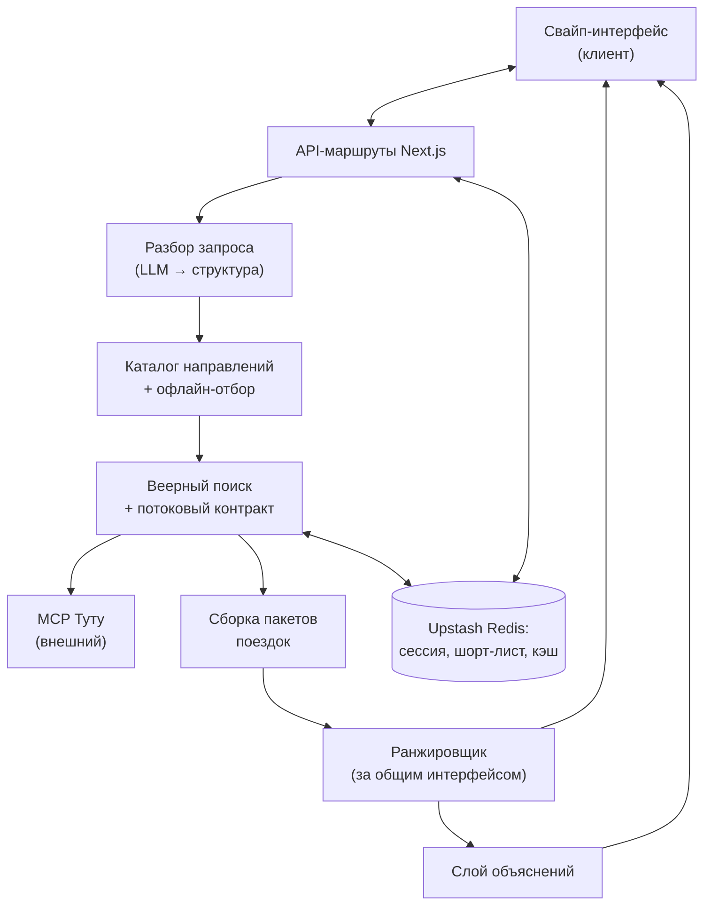
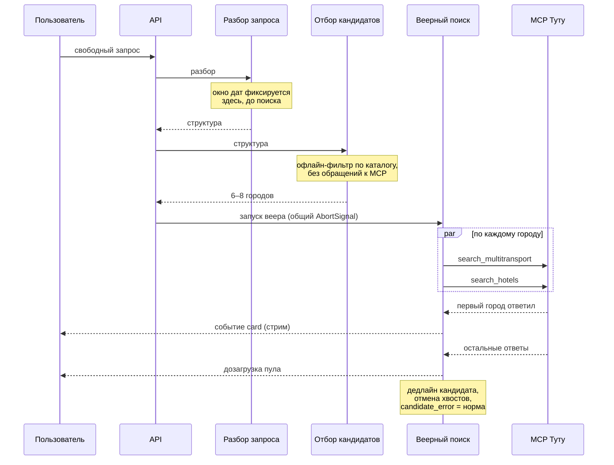
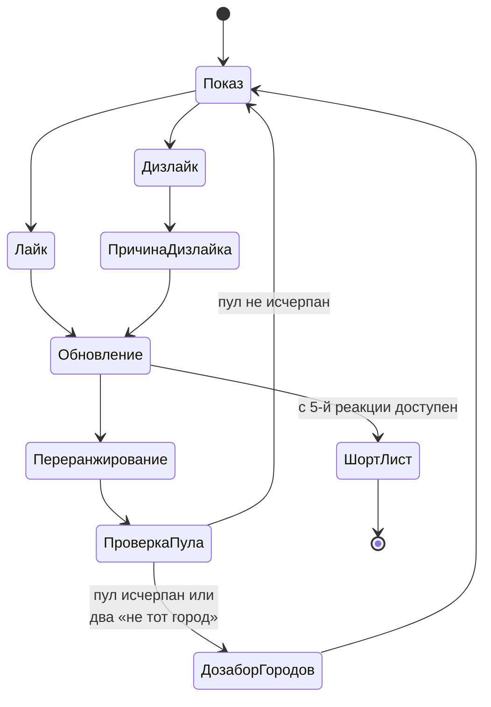

# feat: discovery-механика для Туту (свайп-подбор поездок)

**Origin:** [docs/brainstorms/2026-08-04-tutu-swipe-discovery-requirements.md](../brainstorms/2026-08-04-tutu-swipe-discovery-requirements.md)
**Репозиторий:** `bestmark1/tutu-swipe` (из шаблона `nextjs-agent-template`)
**Дедлайны:** регистрация 14 августа · хакатон 19–20 августа · результаты 21 августа
**Ревизия:** v2 — после критического ревью плана (Codex, 2026-08-04)

---

## Краткое описание

Веб-приложение, которое превращает свободный запрос («на море в сентябре, вдвоём из Москвы, до 60к, чтобы не шумно») в ленту карточек готовых поездок из живого MCP Туту, учится на реакциях пользователя внутри сессии, объясняет свои рекомендации и доводит до перехода на Туту.

Ключевой технический блок — слой discovery, которого в MCP нет: все `search_*` требуют явный `destination`, поэтому направления генерируются и отбираются на нашей стороне.

---

## Проблемная рамка

Discovery в тревел-поиске отсутствует как класс: сервис умеет искать, когда город уже известен. Пользователь, который не знает куда ехать, уходит выбирать в другое место и возвращается только за транзакцией.

**Из чего это следует технически:** нужен собственный слой «запрос → набор городов-кандидатов → веерный поиск по каждому → сборка пакетов → ранжирование», плюс механизм обучения на реакциях, работающий без обучающей выборки.

---

## Стек и ключевые технические решения

### KTD1. Next.js на Vercel, база — шаблон `nextjs-agent-template`

Каркас не пишется с нуля: шаблон уже несёт Next.js 16 + React 19 + TypeScript + Tailwind, Vitest, ESLint, проверку архитектурных границ, CI и список фич как источник истины.

**Следствия для работы:** состояние фич меняется только через `npm run features verify`, `passing` невозможен без вердикта отдельного ревьюера, и каждый юнит этого плана превращается в запись `docs/features.json` с машинной командой верификации.

**Важно для исполнителя:** AGENTS.md шаблона предупреждает, что API этой версии Next.js расходятся с тренировочными данными моделей — перед написанием кода читается `node_modules/next/dist/docs/`, а не память.

### KTD2. MCP-клиент только на сервере

`@modelcontextprotocol/sdk` (актуальная версия — 1.30.0, проверено 2026-08-04), транспорт Streamable HTTP на `https://mcp.tutu.ru/mcp`. Сервер отвечает на POST с `Accept: application/json, text/event-stream` — транспорт подтверждён живым обращением.

Клиент никогда не создаётся в браузере: это скрывает эндпоинт, даёт единую точку для таймаутов, ретраев и кэша.

**Требует проверки на U1:** при Fluid Compute один процесс может обслуживать несколько запросов одновременно, но его сохранность не гарантируется. Клиент-синглтон и размыкатель нуждаются в тестах на параллельные вызовы, переподключение и масштабирование.

### KTD3. Хранилище — Upstash Redis через Vercel Marketplace

First-party Vercel KV закрыт для новых проектов, поэтому провайдер называется явно: Upstash Redis из Marketplace, регион совпадает с регионом функций.

Сессия (реакции, состояние модели, пул карточек) и шорт-лист живут с разными TTL: сессия — часы, шорт-лист — 30 дней, потому что ссылку открывают позже и с другого устройства.

Отвергнут SQLite: не переживает serverless. Отвергнут Postgres: реляционная схема не нужна, лишняя движущаяся часть при оценке за архитектуру.

### KTD4. Потоковая выдача, контракт которой фиксируется до интерфейса

Ответ на запрос — стрим: карточки уходят на клиент по мере готовности отдельных направлений. Без этого критерий «первая карточка ≤ 3 секунд» недостижим при веере по 6–8 городам.

Внутренний контракт потока (`card`, `candidate_error`, `done`, `aborted`) фиксируется в U4 вместе с самим веером, а не в U6. Если веер сначала научится возвращать массив, интерфейс придётся переписывать.

**Оговорка по Vercel:** потоковый ответ не снимает лимит времени выполнения — длительность считается до закрытия ответа. Общий бюджет запроса задаётся явно (KTD7) и укладывается в лимит функции.

### KTD5. Модель — байесовская линейная регрессия с диагональной ковариацией

8–10 плотных признаков. Апостериорное распределение аналитическое, поэтому Thompson sampling корректен: веса сэмплируются из настоящего апостериора, а не из точечной оценки. Состояние модели — два вектора (среднее и диагональ дисперсий) плюс состояние генератора случайных чисел, всё сериализуется в сессию.

Отвергнута обычная онлайн-логрегрессия: даёт веса, но не распределение, из которого сэмплируют, — Thompson sampling поверх неё был бы имитацией. Отвергнуты нейросети и матричная факторизация: 10–15 наблюдений на сессию, любая ёмкая модель на таком объёме — самообман (см. origin, «Рекомендательная механика»).

**Точка отсечения:** если к 15 августа модель не даёт измеримого эффекта — откат к взвешенным правилам на тех же признаках. Чтобы решение было принимаемо, обе реализации живут за общим интерфейсом ранжировщика с общими контрактными тестами и переключателем, а базовая линия измеряется в U14 — **до** 15 августа, а не во время хакатона.

### KTD6. Объяснения — отдельный детерминированный слой

Считаются по агрегатам реакций, а не по коэффициентам модели. Причина: Thompson sampling стохастичен, объяснение из сэмплированных весов будет нестабильным и потенциально ложным.

### KTD7. Единый бюджет времени и один AbortSignal на запрос

Вложенные таймауты и ретраи без общего бюджета опасны: ретрай внутри клиента переживает дедлайн кандидата и продолжает писать в кэш после того, как ответ уже ушёл.

На каждый пользовательский запрос заводится один `AbortSignal`, протянутый до вызовов MCP. Дедлайн кандидата и бюджет ретраев — доли общего бюджета, а не независимые числа. Тест проверяет не только возврат ошибки, но и отсутствие поздних записей в кэш после отмены.

### KTD8. Окно дат фиксируется до поиска, транспорт и жильё ищутся параллельно

Если даты отеля выводить из выбранного транспортного варианта, цепочка становится последовательной (транспорт → выбор → отель → пакет) и бюджет в 3 секунды недостижим.

Поэтому конкретное окно выезда фиксируется на этапе разбора запроса (U5), и по нему транспорт и жильё ищутся параллельно. Правила согласованности из origin (поздний прилёт, ранний выезд) применяются постфактум как предупреждение на карточке, а не как порядок вызовов.

### KTD9. Первичное ранжирование не использует признаки из ленивых деталей

`review_topics` приходят из `get_offer_details`, который грузится лениво после показа карточки. Использовать их для выбора первой карточки — циклическая зависимость.

Первичное ранжирование работает только на признаках из ответа поиска. Темы отзывов входят в модель как признаки второго круга: применяются к карточкам, детали которых уже подгружены, и никогда не блокируют показ.

---

## Высокоуровневая архитектура



Поток запроса с потоковой выдачей и общим бюджетом времени:



Цикл обучения:



---

## Структура проекта

Поверх шаблона (`src/app`, `tests/`, `scripts/` уже существуют):

```text
src/app/
  page.tsx                     # экран запроса
  swipe/[sessionId]/page.tsx   # лента свайпа
  list/[shortlistId]/page.tsx  # шорт-лист по ссылке
  api/
    search/route.ts            # запуск подбора, потоковый ответ
    react/route.ts             # приём реакции, переранжирование
    shortlist/route.ts         # создание и чтение шорт-листа
    checkout/route.ts          # построение перехода на Туту
src/lib/
  mcp/                         # клиент, обёртки вызовов, типы ответов
  discovery/                   # разбор запроса, каталог, офлайн-отбор
  search/                      # веерный поиск, потоковый контракт, бюджет
  packages/                    # сборка пакетов поездок, цены
  ranking/                     # признаки, модель, правила, разнообразие
  explain/                     # детерминированные объяснения
  storage/                     # Redis, схемы сессии и шорт-листа, single-flight
data/
  destinations.json            # каталог направлений с тегами
scripts/
  validate-catalog.mjs         # прогон каталога через MCP на пригодность
tests/
  fixtures/                    # записанные ответы MCP
```

---

## Реализация

Каждый юнит становится записью в `docs/features.json` с машинной командой верификации и требует одобренного ревью отдельным агентом перед переходом в `passing` (см. AGENTS.md шаблона).

### Фаза 1 — фундамент (до 8 августа)

#### U1. MCP-клиент, бюджет времени и фикстуры

**Цель:** живой вызов MCP из серверного кода с единым бюджетом времени, ретраями, размыканием и записанными фикстурами.

**Зависимости:** нет.

**Файлы:** `src/lib/mcp/client.ts`, `src/lib/mcp/tools.ts`, `src/lib/mcp/types.ts`, `src/lib/mcp/budget.ts`, `tests/fixtures/`, `tests/mcp/client.test.ts`

**Подход:** обёртка над `@modelcontextprotocol/sdk` с одной точкой вызова инструмента. Один `AbortSignal` на пользовательский запрос протягивается до MCP; дедлайн вызова и бюджет ретраев — доли общего бюджета (KTD7). Размыкание после серии отказов домена.

Типы ответов пишутся по фактическим ответам сервера: MCP отдаёт схемы входа инструментов, но структура полезной нагрузки описана только в текстовых инструкциях. Перед первой работой с доменом вызывается его `get_<domain>_instructions` — сервер прямо этого требует. Результаты сохраняются в `tests/fixtures/`.

**Замеры на этом шаге** (от них зависят все дедлайны в U4): холодный и тёплый вызов `search_multitransport` и `search_hotels`; наличие ограничений по частоте запросов; поведение клиента-синглтона при параллельных вызовах в одном процессе.

**Сценарии тестов:**
- Успешный вызов на фикстуре возвращает распарсенную структуру с `variants[]`
- Таймаут вызова → помеченный отказ, а не исключение наружу
- Сетевая ошибка → один ретрай; второй отказ → размыкание
- Отмена общего `AbortSignal` останавливает вызов и **не оставляет поздних записей в кэше**
- Ретрай не переживает общий бюджет запроса
- Ответ с неизвестным полем не ломает парсинг
- Отсутствующее необязательное поле (нет `checkout_url`) парсится, поле пустое
- Десять параллельных вызовов через один клиент не смешивают ответы

**Верификация:** `npm run check` зелёный, тесты на фикстурах проходят, ручной вызов из dev возвращает реальные предложения.

---

#### U5. Разбор свободного запроса

**Цель:** из строки на естественном языке получить структуру: город отправления, состав с возрастами детей, **конкретное окно дат**, бюджет, теги вайба.

**Зависимости:** U1.

**Файлы:** `src/lib/discovery/parse.ts`, `src/lib/discovery/schema.ts`, `src/app/page.tsx`, `tests/discovery/parse.test.ts`

**Подход:** вызов LLM со строгой схемой ответа. Юнит стоит в первой фазе, потому что его выходная структура — входной контракт для отбора кандидатов и веера; собирать поиск раньше означает фиксировать контракт задним числом.

Нечёткие даты сводятся к одному конкретному окну **детерминированными правилами** поверх ответа LLM, а не самим LLM: «в сентябре» → фиксированное правило выбора окна. Без этого демо невоспроизводимо даже при фиксированном seed модели.

Блокирующих полей два, а не одно: город отправления и возрасты детей (без `children_ages` нельзя вызвать `search_hotels`). Оба запрашиваются отдельным шагом, а не угадываются.

**Сценарии тестов:**
- Полный запрос со всеми полями разбирается корректно
- Запрос без города отправления → признак «нужно уточнение», поиск не запускается
- Запрос с детьми без возрастов → признак «нужно уточнение», поиск не запускается
- «В сентябре» дважды подряд даёт **одинаковое** окно дат
- Бюджет «до 60к» и «60000 рублей» дают одинаковый результат
- Бюджет трактуется как сумма на всю группу и всю поездку
- Мусорный ввод → осмысленный отказ с подсказкой, а не пустая структура

**Верификация:** двадцать формулировок дают корректные структуры; повторный разбор той же строки даёт идентичный результат.

---

#### U2. Сквозной срез до перехода на Туту

**Цель:** доказать, что вся цепочка живая, включая переход на Туту.

**Зависимости:** U1, U5.

**Файлы:** `src/app/api/search/route.ts`, `src/lib/packages/build.ts`, `src/lib/mcp/checkout.ts`, `src/app/swipe/[sessionId]/page.tsx`, `tests/packages/build.test.ts`

**Подход:** три захардкоженных города, по каждому параллельно `search_multitransport` и `search_hotels` на фиксированном окне дат, сборка минимального пакета, три простые карточки, переход через `create_checkout_link`.

Минимальный checkout **входит** в этот юнит — иначе срез не сквозной. U10 расширяет его до всех типов продуктов, а не реализует заново.

**Сценарии тестов:**
- Сборка пакета даёт итоговую цену = сумма компонентов
- Цена отеля берётся как `stay_total` и не умножается на число ночей
- Пакет без ответа по жилью не создаётся, город пропускается
- Переход возвращает ссылку и `kind` для простейшего случая

**Верификация:** с главной страницы можно дойти до открытого Туту с предзаполненным состоянием.

---

### Фаза 2 — discovery (до 13 августа)

#### U13. Хранилище, кэш и защита от лавины запросов

**Цель:** Redis подключён, кэш и состояние сессии работают предсказуемо при параллельных запросах.

**Зависимости:** U1.

**Файлы:** `src/lib/storage/redis.ts`, `src/lib/storage/session.ts`, `src/lib/storage/cache.ts`, `src/lib/storage/single-flight.ts`, `tests/storage/*.test.ts`

**Подход:** выделен из U4, потому что тот был неподъёмным и непроверяемым как целое. Upstash Redis из Marketplace, регион совпадает с регионом функций, переменные окружения — через `.env.local.example`.

Кэш с нормализованным ключом (город отправления, город назначения, окно дат, состав) и коротким TTL; возраст записи хранится и показывается пользователю. Против одновременного веера при промахе кэша — распределённый single-flight, обычный cache-aside от лавины не спасает.

Состояние сессии версионируется, реакции применяются идемпотентно по ключу реакции: маршруты стрима, реакции, undo и ленивых деталей пишут в одну сессию из разных запросов.

**Сценарии тестов:**
- Запись и чтение сессии переживают смену процесса
- Повторная реакция с тем же ключом идемпотентности применяется один раз
- Две параллельные реакции не теряются и не перезаписывают друг друга
- Запоздавший ответ с устаревшей версией сессии отвергается
- Промах кэша в двух параллельных запросах порождает **один** веер
- Запись кэша старше TTL игнорируется
- Повреждённая или частично записанная запись кэша трактуется как промах
- Отказ Redis → явное недоступное состояние, а не молчаливая потеря

**Верификация:** нагрузочный прогон десяти параллельных сессий не теряет реакций.

---

#### U3. Каталог направлений и офлайн-отбор

**Цель:** из разобранного запроса получить 6–8 городов-кандидатов без единого обращения к MCP, с доказанной пригодностью каталога.

**Зависимости:** U1, U5.

**Файлы:** `data/destinations.json`, `src/lib/discovery/catalog.ts`, `src/lib/discovery/select.ts`, `scripts/validate-catalog.mjs`, `tests/discovery/select.test.ts`

**Подход:** каталог 40–60 городов с тегами: тип локации, сезонность, досягаемость из крупных городов отправления, ценовой класс.

Пригодность доказывается **воспроизводимым скриптом**, а не обещанием: `validate-catalog.mjs` прогоняет каталог через MCP по матрице «типичное отправление × сезонное окно», сохраняет результат с датой прогона рядом с каталогом и помечает города без предложений. Скрипт перезапускается перед хакатоном. Это признаётся ограниченной гарантией: пригодность для конкретных дат пользователя проверяется только веером, поэтому пустой результат по кандидату остаётся штатной ситуацией в U4.

Отбор — детерминированные правила по тегам, без LLM: предсказуемо по времени и не выдаёт городов, куда нельзя доехать.

**Сценарии тестов:**
- Запрос «море, сентябрь» отбирает только приморские города с летней сезонностью
- Город отправления исключается из кандидатов
- Бюджет ниже минимального ценового класса → отбираются самые дешёвые с пометкой «выше бюджета», список не пустеет
- Отбор возвращает от 3 до 8 кандидатов
- Города, помеченные скриптом как непригодные, не попадают в отбор
- Отбор детерминирован: одинаковый вход → одинаковый выход

**Верификация:** `node scripts/validate-catalog.mjs` проходит, отчёт свежий, десять разных запросов дают различающиеся осмысленные наборы.

---

#### U4. Веерный поиск, потоковый контракт и сборка пакетов

**Цель:** параллельный поиск по кандидатам с бюджетом времени, выдающий результаты по мере готовности.

**Зависимости:** U1, U3, U13.

**Файлы:** `src/lib/search/fanout.ts`, `src/lib/search/stream.ts`, `src/lib/packages/build.ts`, `tests/search/fanout.test.ts`, `tests/search/stream.test.ts`

**Подход:** ограниченная параллельность, дедлайн кандидата как доля общего бюджета (KTD7), отмена хвостов после набора достаточного пула.

**Потоковый контракт фиксируется здесь**, а не в интерфейсе: асинхронный источник событий `card` / `candidate_error` / `done` / `aborted`. U6 потребляет этот контракт, не изобретая свой.

Внутри кандидата транспорт и жильё запрашиваются параллельно по общему окну дат (KTD8). Сборка пакета применяет правила согласованности постфактум: поздний прилёт или ранний выезд дают предупреждение на карточке.

**Сценарии тестов:**
- Веер по 8 городам, три отвечают дольше дедлайна → пул содержит пять, наружу идут `candidate_error`, не исключения
- Первое событие `card` приходит до завершения всего веера
- Все города не ответили → `done` с пустым пулом, а не исключение
- Отмена запроса → `aborted`, хвостовые вызовы прекращены
- Прилёт после 22:00 → пакет с флагом предупреждения
- Омоним в названии города (`also_named[]`) → пакет несёт признак неоднозначности
- Ответ по транспорту есть, по жилью нет → кандидат пропускается с `candidate_error`

**Верификация:** замер на production-деплое — первое событие `card` не позже 2 секунд от старта веера (остаток бюджета до 3 секунд оставлен на разбор запроса, отбор, cold start и установление стрима).

---

### Фаза 3 — обучение и интерфейс (до 18 августа)

#### U6. Потоковая выдача и свайп-интерфейс

**Цель:** лента карточек с реакциями, первая карточка не позже 3 секунд **от отправки запроса пользователем**.

**Зависимости:** U4, U13.

**Файлы:** `src/app/swipe/[sessionId]/page.tsx`, `src/app/api/search/route.ts`, `src/app/api/react/route.ts`, `tests/api/search.test.ts`

**Подход:** маршрут поиска транслирует контракт из U4 наружу, клиент отрисовывает карточки по мере поступления. Детали карточки грузятся лениво после показа и никогда не блокируют первый экран.

Обязательны состояния: загрузка, пустая выдача, частичный отказ, конец пула, потеря соединения с переподключением. Обязательны undo последней реакции и tap-альтернатива свайпу.

**Примечание по исполнению:** начать с интеграционного теста на потоковый контракт — он определяет и клиент, и сервер.

**Сценарии тестов:**
- Первая карточка на экране до завершения веера
- Обрыв стрима → переподключение без потери уже показанных карточек и без битой сессии
- Обновление страницы восстанавливает сессию из хранилища
- Пустой пул → состояние «ничего не нашли» с предложением смягчить запрос
- Undo возвращает предыдущую карточку и откатывает реакцию, модель и позицию в пуле
- Двойное нажатие реакции засчитывается один раз
- Реакция по tap даёт тот же эффект, что свайп

**Верификация:** замер на production-деплое с мобильного, холодная функция и холодный кэш: от отправки запроса до первой карточки — не более 3 секунд по p95 из десяти прогонов.

---

#### U7. Модель предпочтений и реакции с причинами

**Цель:** выдача перестраивается по реакциям, включая явные причины дизлайка.

**Зависимости:** U6.

**Файлы:** `src/lib/ranking/interface.ts`, `src/lib/ranking/features.ts`, `src/lib/ranking/bayesian.ts`, `src/lib/ranking/rules.ts`, `src/lib/ranking/diversity.ts`, `tests/ranking/*.test.ts`

**Подход:** 8–10 плотных признаков из ответа поиска. Признаки из ленивых деталей (темы отзывов) — второй круг, не участвуют в выборе первой карточки (KTD9).

Байесовская линейная регрессия с диагональной ковариацией, Thompson sampling из апостериора, сериализуемое состояние вместе с состоянием генератора. Правило разнообразия: среди любых 5 подряд не более 2 карточек одного города.

**Обе реализации ранжировщика — модель и взвешенные правила — пишутся за общим интерфейсом** с общими контрактными тестами и переключателем. Это делает точку отсечения 15 августа реально исполнимой, а не декларативной.

Причины дизлайка входят в обновление: «дорого» двигает вес цены, «долго добираться» — вес времени, «не тот отель» — веса признаков жилья, «не тот город» исключает город из пула. Два дизлайка «не тот город» подряд запускают дозабор кандидатов из U3 и новый веер.

**Сценарии тестов:**
- Три лайка на прямые рейсы → карточки с пересадками опускаются
- Дизлайк «не тот город» → город больше не появляется
- Два «не тот город» подряд → запускается дозабор кандидатов
- Дизлайк «дорого» → медианная цена следующих карточек ниже
- Дизлайк «не тот отель» → двигаются веса признаков жилья, не транспорта
- Правило разнообразия соблюдается на любом окне из 5 карточек
- Одинаковый seed и одинаковая последовательность реакций → идентичная последовательность карточек
- Обе реализации ранжировщика проходят один и тот же контрактный набор
- Все реакции одного знака → разведка всё ещё показывает непохожие варианты

**Верификация:** контрактные тесты зелёные для обеих реализаций, переключатель работает.

---

#### U14. Протокол воспроизведения и базовая линия

**Цель:** измеримо ответить, работает ли обучение, до наступления точки отсечения.

**Зависимости:** U7.

**Файлы:** `src/lib/ranking/replay.ts`, `tests/fixtures/sessions/`, `tests/ranking/replay.test.ts`, `docs/ranking-baseline.md`

**Подход:** живое сравнение «доля лайков выросла» не является тестом — результат зависит от человека, порядка карточек и истощения пула. Вместо него — протокол воспроизведения: записанные сессии реакций проигрываются на **зафиксированном снимке пула** через каждую реализацию ранжировщика.

Метрика — позиция понравившихся карточек в выдаче при одинаковом входе: обучение против статического ранжирования по цене и против случайного порядка. Одинаковый вход для всех трёх — единственный способ получить честное сравнение.

Результат записывается в `docs/ranking-baseline.md` с датой и идёт на слайд питча.

**Сценарии тестов:**
- Воспроизведение одной записанной сессии даёт идентичный результат при повторе
- Три реализации прогоняются на одном снимке пула
- Снимок пула не зависит от живого MCP — воспроизведение работает офлайн
- Метрика считается детерминированно

**Верификация:** отчёт `docs/ranking-baseline.md` получен **до 15 августа**; на его основании принимается решение по точке отсечения.

---

#### U8. Слой объяснений

**Цель:** карточка честно объясняет своё присутствие, когда для этого достаточно данных.

**Зависимости:** U7.

**Файлы:** `src/lib/explain/aggregate.ts`, `src/lib/explain/phrases.ts`, `tests/explain/aggregate.test.ts`

**Подход:** агрегаты по реакциям, шаблонные формулировки, порог подтверждений. Без порога объяснение не показывается вовсе: не показать лучше, чем показать выдуманное — то же правило грунтования, которого требует сам MCP.

**Сценарии тестов:**
- Одна реакция → объяснение не показывается
- Три согласованных лайка по признаку → объяснение с этим признаком
- Противоречивые реакции по признаку → объяснение по нему не показывается
- Объяснение не ссылается на признак, отсутствующий в данных карточки
- Формулировка стабильна между двумя вызовами при одном состоянии сессии
- Объяснение не зависит от сэмплированных весов

**Верификация:** на записанной сессии из 10 реакций объяснения читаются как правда.

---

### Фаза 4 — завершение (хакатон)

#### U9. Шорт-лист, персистентность и шеринг

**Цель:** до трёх вариантов по ссылке, открываемой на чужом устройстве.

**Зависимости:** U7, U13.

**Файлы:** `src/app/list/[shortlistId]/page.tsx`, `src/app/api/shortlist/route.ts`, `src/lib/storage/shortlist.ts`, `tests/api/shortlist.test.ts`

**Подход:** доступен с 5-й реакции, меняется до 9-й, замораживается на 10-й. TTL 30 дней — сознательное сужение «постоянной ссылки» из origin: для хакатона достаточно, продление тривиально.

Страница самодостаточна: не требует сессии, открывается в холодном браузере, показывает цены с их возрастом и переходы на Туту.

**Сценарии тестов:**
- Недоступен до 5-й реакции
- Меняется между 5-й и 9-й реакцией
- Заморожен после 10-й: новые реакции его не меняют
- Ссылка открывается без cookies и без сессии
- Истёкший или несуществующий идентификатор → осмысленная страница, не 500
- Содержит не более трёх вариантов
- Возраст цены отображается на каждой карточке

**Верификация:** ссылка, отправленная в мессенджер, открывается на другом телефоне и ведёт на Туту.

---

#### U10. Переход на Туту для всех типов продуктов

**Цель:** расширить минимальный переход из U2 до всех продуктов с честными надписями.

**Зависимости:** U2, U9.

**Файлы:** `src/app/api/checkout/route.ts`, `src/lib/mcp/checkout.ts`, `tests/mcp/checkout.test.ts`

**Подход:** `create_checkout_link` с полями из `checkout_ref`. Возвращаемый `kind` определяет надпись: корзина, выбор мест или страница поиска. Состав пассажиров прокидывается обязательно — иначе Туту откроет корзину на одного взрослого и сумма не сойдётся.

Переход открывается синхронно по нажатию, а не после асинхронного вызова: иначе браузер заблокирует новое окно. Ссылка готовится заранее, на нажатии только открывается.

**Сценарии тестов:**
- Прямой авиа round-trip → `kind = deeplink`, надпись «Открыть корзину»
- Round-trip с пересадками → `kind = search_redirect`, надпись «Открыть подборку на Туту»
- Состав из двух взрослых и ребёнка прокидывается полностью
- Оффер `is_multi_pnr` → примечание показано до перехода
- Отель без выбранного номера → страница отеля, а не корзина
- Ошибка или таймаут `create_checkout_link` → сообщение и ссылка на результаты поиска
- Протухший `checkout_ref` → переход на поиск, а не битая страница
- Предупреждение об изменении цены показано перед каждым переходом

**Верификация:** для каждого типа продукта переход открывает ожидаемую страницу Туту на мобильном браузере.

---

#### U11. Устойчивость и репетиция демо

**Цель:** ничего не падает на защите, сценарий воспроизводим.

**Зависимости:** U6, U7, U9, U14.

**Файлы:** `src/lib/search/fanout.ts`, `src/app/api/search/route.ts`, `docs/demo-script.md`, `tests/e2e/`

**Подход:** детерминированность демо обеспечивается не только seed модели, но и снимком входного пула из U14 плюс детерминированными правилами дат из U5. Прогрев кэша по маршрутам сценария.

Отказ хранилища → явное недоступное состояние, а не мнимая деградация «в память процесса»: маршрут реакции — отдельный запрос и может попасть в другой процесс.

**Сценарии тестов (сквозные, на production-деплое):**
- Холодная функция и холодный кэш — полный путь проходит
- Один компонент пары транспорт/жильё упал — карточки всё равно есть
- Ответ 429 с `Retry-After` — запрос уважает заголовок, экран не падает
- Обрыв и переподключение стрима на середине
- Обновление страницы посередине сессии
- Отказ Redis → явное сообщение, не тихая потеря реакций

**Верификация:** три полных прогона сценария подряд на production URL с мобильного, включая один с холодным стартом.

---

#### U12. Документация (сопровождает все фазы)

**Цель:** репозиторий читается как код, с которым можно работать; презентация укладывается в 10 минут.

**Зависимости:** обновляется по завершении каждой фазы, а не в конце.

**Файлы:** `AGENTS.md`, `README.md`, `PROGRESS.md`, `docs/architecture.md`, `docs/demo-script.md`, `docs/surprises.md`

**Подход:** документация — не финальный юнит, а обязательство каждой фазы: от неё зависит и работа исполнителя, и 10 баллов оценки. Плейсхолдеры в `AGENTS.md` шаблона заполняются **до первого кода**, как того требует сам шаблон.

`docs/architecture.md` объясняет, **почему** существует слой discovery — это главный технический тезис проекта и первый вопрос жюри. Сценарий демо на 6–8 свайпов с показом сравнения из U14 бок о бок.

Неудачные эксперименты пишутся в `docs/surprises.md` — иначе следующая сессия повторит их заново.

**Ожидание по тестам:** нет — документация не несёт поведения. Проверяется чеклистом шаблона.

**Верификация:** после каждой фазы `npm run check` зелёный, `PROGRESS.md` отражает реальность, в `AGENTS.md` не осталось плейсхолдеров.

---

## Границы плана

**Не входит:** синхронный свайп с нескольких устройств, аккаунты и авторизация, оплата и бронирование, обучение на исторических данных, мобильное приложение.

**Отложено:** брендированные подборки под спецпроекты маркетинга (на питче — как продолжение), голосовое управление фильтрами.

**Точки отсечения при просрочке:** U3 — каталог сокращается до 30 городов; U7 — ранжировщик переключается на взвешенные правила по результату U14; U6 — анимации отсекаются, состояния загрузки и пустоты остаются обязательными.

---

## Риски

| Риск | Влияние | Смягчение |
|---|---|---|
| Веер не укладывается в 3 секунды от отправки запроса | Ломает главный UX-критерий | Замеры на U1 до постройки чего-либо; параллельные транспорт и жильё (KTD8), потоковый контракт в U4, замер p95 на production в U6 |
| MCP нестабилен на защите | Демо не проходит | `candidate_error` как норма (U4), уважение `Retry-After`, кэш и single-flight (U13), прогрев, сквозные сценарии отказов (U11) |
| Ограничения по частоте запросов к MCP | Веер упирается в лимиты | Выясняется замером на U1; при жёстком лимите веер сужается до 4–5 городов |
| Модель не даёт эффекта | Исчезает заявленный отрыв | U14 даёт цифру до 15 августа; обе реализации за общим интерфейсом, переключение — конфигурация |
| Потеря реакций при параллельных запросах | Обучение выглядит сломанным | Версионирование сессии и идемпотентность в U13 |
| Отказ хранилища | Сессия рассыпается | Явное недоступное состояние, не мнимая деградация в память процесса (U11) |

---

## Открытые вопросы

1. **Есть ли у MCP ограничения по частоте запросов?** В инструкциях сервера не упомянуты. Выясняется замером на U1.
2. **Какая LLM разбирает запрос и откуда ключ?** Влияет на задержку первого шага и на бюджет времени. Решается до U5.
3. **Даёт ли `tutu://special-offers` полезный сигнал для отбора кандидатов?** Помечен экспериментальным. Проверяется на U3; до проверки не закладываемся.

---

## Отложено на время реализации

- Переиспользование MCP-соединения между инвокациями — зависит от наблюдаемого поведения Fluid Compute (замер на U1)
- Точные значения дедлайнов и размера пула — калибруются замерами на U4
- Конкретный набор тем отзывов в признаках второго круга — зависит от того, что реально возвращает `review_topics`
- Точная форма потокового протокола наружу — внутренний контракт фиксируется на U4, транспорт наружу выбирается на U6
